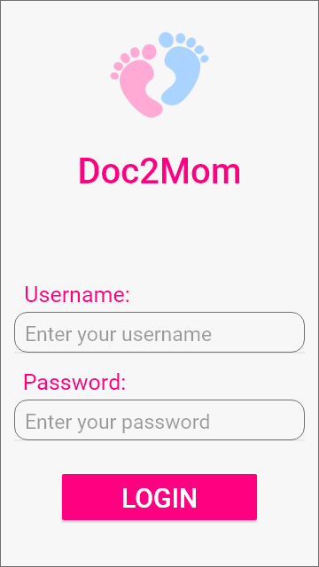
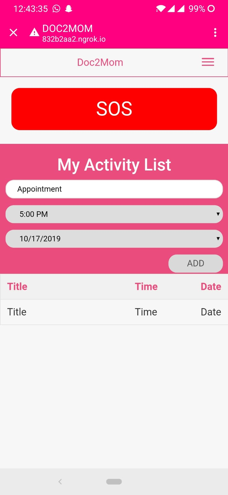
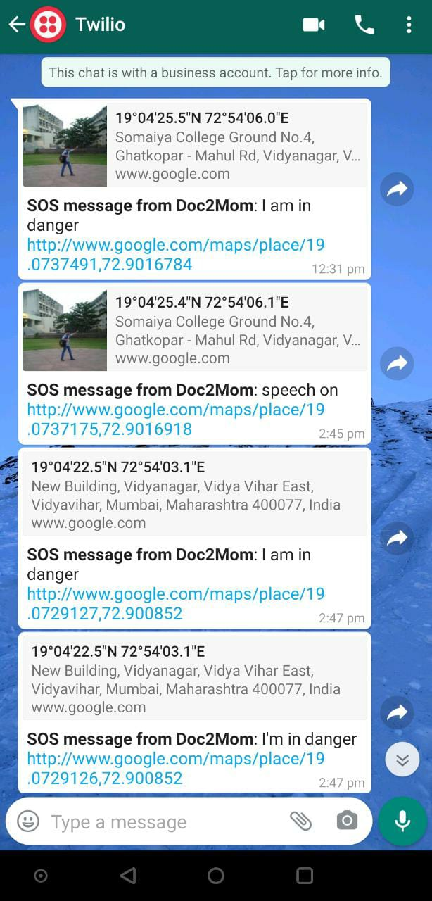

# Doc2Mom

### Features

- During Pregnancy mothers send SOS message to the registered list of people.
- Activity list can be added.
- Calender events can be created.
- SOS message goes to WhatsApp for now. (Using Twilio)
- Reports can be shared by the doctor and viewed by the mother.
- PWA can be generated.

<h3 > Screenshots  </h3>
 

 
 

 
 

 

### TODO

- [] Local SMS Feature.
- [] Calling Feature.

 

### Contributors

- [g-bhagwanani](https://github.com/g-bhagwanani)
- [mihir2510](https://github.com/mihir2510)
- [GaurangAthavale](https://github.com/GaurangAthavale)
- [deepdama10](https://github.com/deepdama10)

 

### Recognition

- This project was made during KJSCE Hack which was 24hrs Hackathon hosted by KJSCE Codecell.